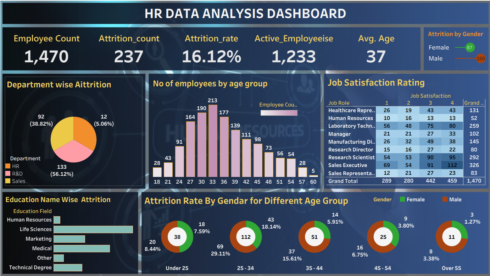

# 📊 HR Data Analysis Dashboard

An interactive **HR Analytics Dashboard** built using **Tableau** to analyze employee data, workforce trends, and attrition patterns. This dashboard helps HR professionals and business leaders make data-driven decisions regarding employee retention, satisfaction, and workforce planning.

---

## 📌 Project Overview

The HR Data Analysis Dashboard provides insights into employee demographics, attrition trends, job satisfaction, and workforce distribution. The dashboard enables organizations to identify factors affecting employee turnover and improve employee engagement strategies.

---

## 🎯 Objectives

- Analyze employee attrition across departments.
- Monitor overall workforce statistics.
- Understand age-group distribution of employees.
- Measure job satisfaction levels by job role.
- Analyze attrition based on gender and age groups.
- Study the impact of education fields on employee turnover.

---

## 🛠️ Tools & Technologies Used

- **Tableau Public/Desktop**
- **Microsoft Excel / CSV Dataset**
- **Data Cleaning & Transformation**
- **Interactive Data Visualization**

---

## 📈 Dashboard KPIs

| KPI | Value |
|-----|-------|
| Total Employees | 1,470 |
| Attrition Count | 237 |
| Attrition Rate | 16.12% |
| Active Employees | 1,233 |
| Average Age | 37 Years |

---

## 📊 Dashboard Features

### 1. Employee Overview
- Displays total employee count.
- Shows active employees and average employee age.

### 2. Attrition Analysis
- Department-wise attrition analysis.
- Gender-wise attrition comparison.
- Attrition rate across different age groups.

### 3. Workforce Distribution
- Employee distribution by age groups.
- Analysis of education fields.

### 4. Job Satisfaction Analysis
- Job satisfaction ratings categorized by job roles.
- Helps identify roles with lower satisfaction levels.

---

## 📷 Dashboard Preview



> Replace `dashboard.png` with your dashboard screenshot file name after uploading it to GitHub.

---

## 🔍 Key Insights

- The overall employee attrition rate is **16.12%**.
- The **R&D department** experiences the highest attrition.
- Employees in the **25–34 age group** show higher turnover.
- Certain job roles exhibit lower satisfaction scores, indicating potential retention challenges.
- Employee attrition varies across education fields and gender categories.

---

## 🚀 How to Use

1. Download the Tableau workbook (`.twb` or `.twbx`).
2. Open it using **Tableau Desktop/Public**.
3. Connect the dataset if required.
4. Interact with filters and visualizations to explore HR insights.

---

## 📂 Project Structure

```bash
HR-Data-Analysis-Dashboard/
│--
├── HR_Data_Analysis.twbx
├── dataset.xlsx
├── dashboard.png
└── README.md
